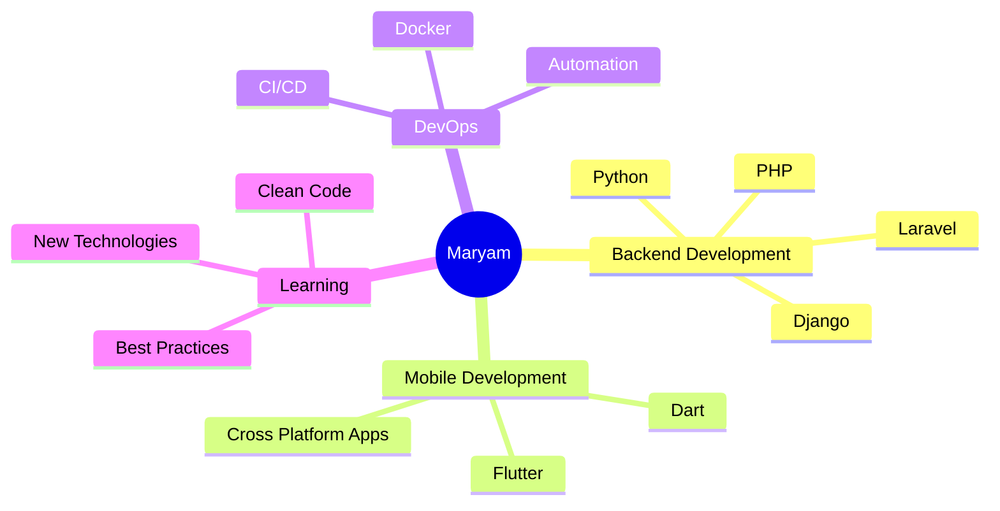
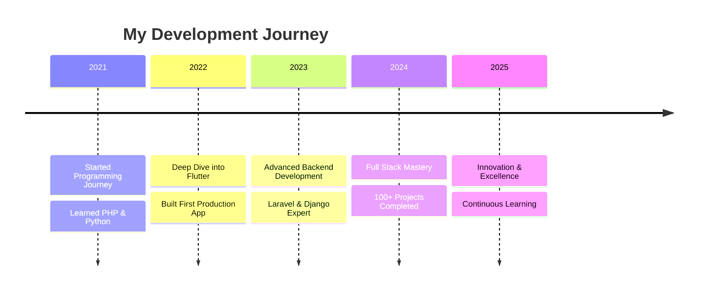

<div align="center">

<!-- Animated Header with 3D Effect -->


<!-- 3D Rotating Avatar -->


</div>

<!-- Animated Divider -->


##  About Me


```python
class MaryamAzadmehr:
    def __init__(self):
        self.name = "Maryam Azadmehr"
        self.role = "Full Stack Developer"
        self.experience = "4 Years"
        self.languages = ["PHP", "Python", "Flutter"]
        self.passion = "Creating Beautiful Applications"
    
    def say_hi(self):
        print("Thanks for visiting my profile! Let's build something amazing together!")

me = MaryamAzadmehr()
me.say_hi()
```

<br clear="both">

<!-- Animated Divider -->


## 🚀 Tech Stack & Skills

<div align="center">

### 💻 Languages & Frameworks

<table>
<tr>
<td align="center" width="96">

<br>PHP
</td>
<td align="center" width="96">

<br>Python
</td>
<td align="center" width="96">

<br>Flutter
</td>
<td align="center" width="96">

<br>Dart
</td>
<td align="center" width="96">

<br>Laravel
</td>
<td align="center" width="96">

<br>Django
</td>
</tr>
</table>

### 🛠️ Tools & Technologies

<table>
<tr>
<td align="center" width="96">

<br>Git
</td>
<td align="center" width="96">

<br>GitHub
</td>
<td align="center" width="96">

<br>VS Code
</td>
<td align="center" width="96">

<br>MySQL
</td>
<td align="center" width="96">

<br>PostgreSQL
</td>
<td align="center" width="96">

<br>Docker
</td>
</tr>
</table>

</div>

<!-- Animated Divider -->


## 📊 GitHub Statistics

<div align="center">


</div>

<!-- Animated Divider -->


## 🏆 GitHub Trophies

<div align="center">

[](https://github.com/ryo-ma/github-profile-trophy)

</div>

<!-- Animated Divider -->


## 📈 Contribution Graph

<div align="center">

[](https://github.com/ashutosh00710/github-readme-activity-graph)

</div>

<!-- Animated Divider -->


## 🎯 Current Focus

<div align="center">



</div>

<!-- Animated Divider -->


## 💼 Experience Timeline

<div align="center">



</div>

<!-- Animated Divider -->


## 📫 Connect With Me

<div align="center">

[](https://github.com/MaryamAzadmehr)
[](https://linkedin.com/in/maryam-azadmehr)
[](mailto:maryam.azadmehr@gmail.com)
[](https://maryamazadmehr.dev)

</div>

<!-- Animated Divider -->


## 🐍 Contribution Snake

<div align="center">


</div>

<!-- Animated Divider -->


## 📌 Pinned Repositories

<div align="center">

[](https://github.com/MaryamAzadmehr/awesome-flutter-app)
[](https://github.com/MaryamAzadmehr/laravel-api-starter)

</div>

<!-- Animated Divider -->


## 💡 Random Dev Quote

<div align="center">


</div>

<!-- Animated Divider -->


## 🎮 Fun Facts

<div align="center">

```typescript
const funFacts = {
    experience: "4 years of turning coffee into code ☕",
    languages: ["PHP 🐘", "Python 🐍", "Flutter 💙"],
    motto: "Clean code is not written by following a set of rules. " +
           "You don't become a software craftsman by learning a list of heuristics. " +
           "Professionalism and craftsmanship come from values that drive disciplines.",
    currentlyLearning: "Always learning something new! 🚀",
    hobbies: ["Coding", "Problem Solving", "Building Cool Stuff"],
    availableForHire: true
};
```

</div>

<!-- Animated Divider -->


## 👀 Profile Views

<div align="center">


</div>

<!-- Animated Footer -->
<div align="center">


### ⭐ From [MaryamAzadmehr](https://github.com/MaryamAzadmehr) with 💖

**"Code is like humor. When you have to explain it, it's bad!"** 😄

</div>
<!-- Last Updated: 2025-11-25 10:22:29 UTC -->
<!-- Last Updated: 2025-11-25 11:17:08 UTC -->
<!-- Last Updated: 2025-11-25 12:39:40 UTC -->
<!-- Last Updated: 2025-11-25 13:33:01 UTC -->
<!-- Last Updated: 2025-11-25 14:19:04 UTC -->
<!-- Last Updated: 2025-11-25 15:21:03 UTC -->
<!-- Last Updated: 2025-11-25 16:26:13 UTC -->
<!-- Last Updated: 2025-11-25 17:18:53 UTC -->
